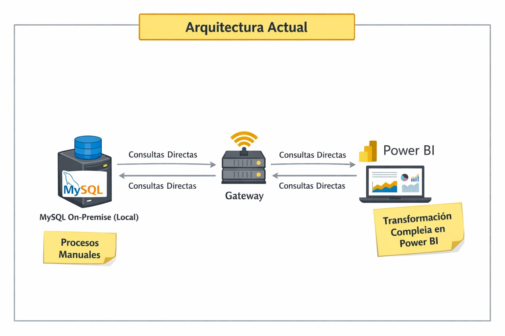
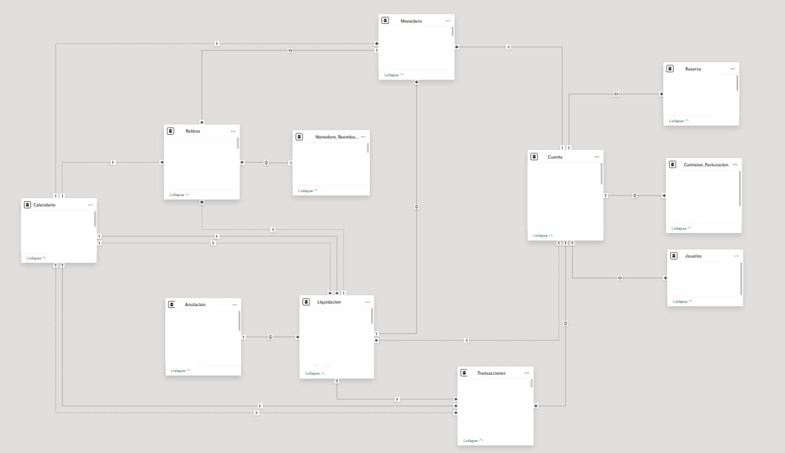
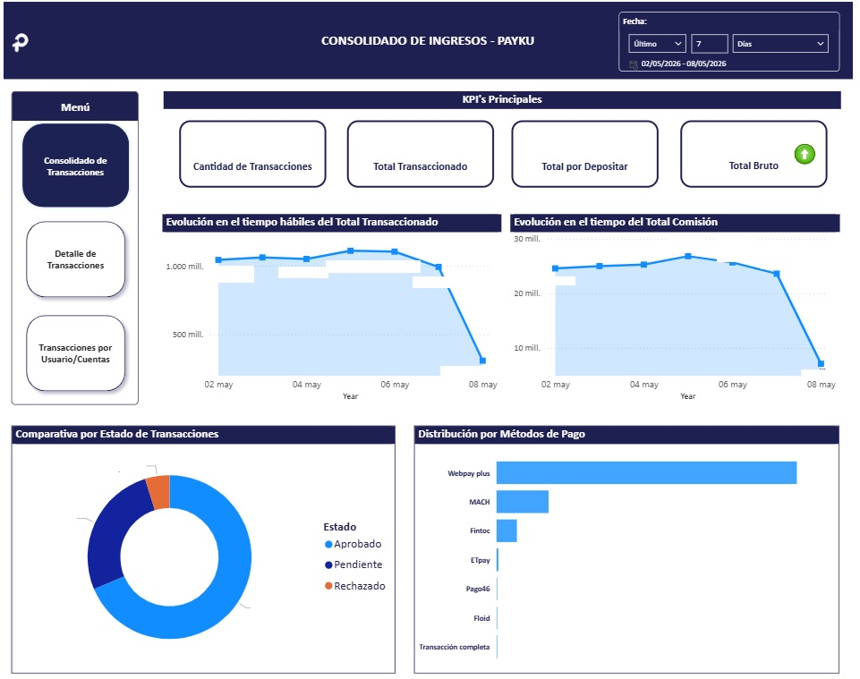
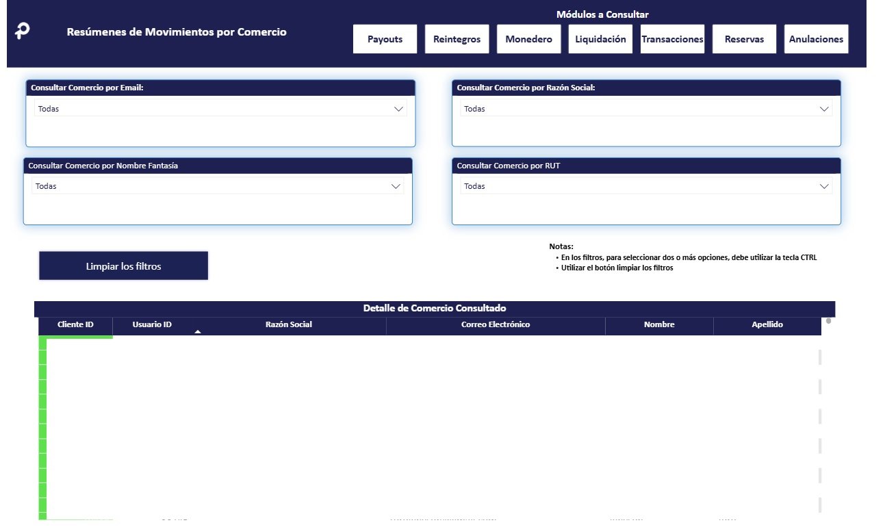

# 📊 Case Study: Implementación de Arquitectura BI desde Cero

## 📝 Resumen del Proyecto
Este proyecto representa la transición de una gestión de datos inexistente hacia una infraestructura de **Business Intelligence profesional**. Se diseñó e implementó la arquitectura completa, permitiendo a la organización pasar de procesos manuales a una cultura *data-driven* con datos confiables y automatizados  distribuidos en 3 proyectos: CHILE - VENEZUELA Y PERÚ.

---

## 🎯 El Reto
La empresa no contaba con una estrategia de datos. La información residía en bases de datos transaccionales sin procesar, lo que imposibilitaba el análisis histórico, generaba lentitud en las consultas y carecía de una "única fuente de verdad".

---

## 🛠️ Solución Implementada

### 1. Análisis y Extracción
* **Auditoría de Datos:** Análisis profundo de la base de datos origen para entender la lógica de negocio y la calidad de la información.
* **Limpieza (Data Cleansing):** Estandarización de tipos de datos, tratamiento de nulos y normalización de registros mediante Power Query.
* **Infraestructura de Conectividad:** Configuración y administración de un **On-premises Data Gateway** instalado en un **servidor dedicado** exclusivamente para garantizar la comunicación segura entre el entorno local y Power BI Service.

---

### 2. Arquitectura y Modelado
* **Diseño de la Arquitectura de Datos:** Implementación de un flujo híbrido que conecta la base de datos MySQL local con la nube de Power BI a través de un Gateway en un servidor dedicado.

* **Diseño de Modelo en Estrella:** Creación de un **Modelo Semántico** eficiente separando Tablas de Hechos (Facts) y Dimensiones (Dims).

* **Optimización de Recursos:** Implementación de **Live Connection** para permitir que múltiples reportes consuman el mismo modelo. Esto garantiza la consistencia de las métricas (Única Fuente de Verdad) y reduce drásticamente el uso de almacenamiento y memoria.
* **Integridad Referencial:** Establecimiento de relaciones (Joins) respetando estrictamente las reglas del negocio para evitar duplicidad o pérdida de información.

---

### 3. Optimización de Carga: Actualización Incremental
Dada la naturaleza transaccional del negocio Fintech, implementé una estrategia de **Incremental Refresh** para maximizar el rendimiento:
* **Configuración de Parámetros:** Uso de `RangeStart` y `RangeEnd` para segmentar la ingesta de datos.
* **Eficiencia de Recursos:** Reducción del tiempo de refresco al procesar solo los datos nuevos, minimizando el impacto en el servidor MySQL origen ni excediendo los límites de memoria de Power BI Service.

---

### 4. Distribución y Democratización de Datos
Para maximizar el valor del modelo semántico centralizado, se desplegó un ecosistema de visualización de alto impacto:
* **Ecosistema de Reportes:** Creación de **15 dashboards especializados** que consumen el modelo único vía *Live Connection*, asegurando que todas las áreas consulten la misma información.
* **Alcance Departamental:** Implementación de soluciones analíticas a medida para:
    * **Compliance:** Monitoreo de riesgos y cumplimiento normativo.
    * **Atención al Cliente:** KPIs de servicio, tiempos de respuesta y satisfacción.
    * **RRHH:** Gestión de talento y métricas operativas de personal.
    * **Contabilidad & Gerencial:** Control financiero y visión estratégica de alto nivel.
    * **Operativos:** Seguimiento de procesos core en tiempo real.

---

## 5. 📊 Componentes Técnicos
* **Base de Datos:** MySQL (On-Premises)
* **Conectividad:** Data Gateway en Servidor Dedicado
* **Modelado:** Esquema en Estrella (Star Schema)
* **Herramientas:** Power BI Desktop, DAX, Power Query
* **Automatización:** Actualización Incremental (Schedule diario)

---

## 6. 💡 Impacto en el Negocio
* **Eficiencia Operativa:** Reducción del **100% en el tiempo manual** de preparación de reportes mediante la automatización de la ingesta y el modelado.
* **Escalabilidad:** Diseño lógico (Modelo Estrella) preparado para absorber un incremento volumétrico sin necesidad de reestructurar la lógica de negocio.
* **Confianza & Calidad:** Consolidación de una "Única Fuente de Verdad", eliminando discrepancias de datos en un **20%** entre departamentos.
* **Optimización de Carga:** Gracias a la actualización incremental, el tiempo de procesamiento en el servidor disminuyó en un **60%**, evitando bloqueos en la base de datos transaccional.

---

## 7. ⚠️ Desafíos y Diagnóstico Técnico
Actualmente, la arquitectura ha identificado puntos críticos de mejora debido al crecimiento de los datos:
* **Cuellos de Botella:** El servidor dedicado al Gateway está experimentando saturación durante los procesos de actualización, lo que limita la velocidad de disponibilidad de la información.

---

## 8. 🚀 Próximos Pasos (RoadMap)
Como estrategia de optimización y escalabilidad, se ha definido:
* **Migración a la Nube:** Evolucionar la arquitectura hacia **Google Cloud Platform (GCP)** para eliminar la dependencia de servidores físicos, suprimir los cuellos de botella del Gateway y mejorar la alta disponibilidad del ecosistema analítico.

