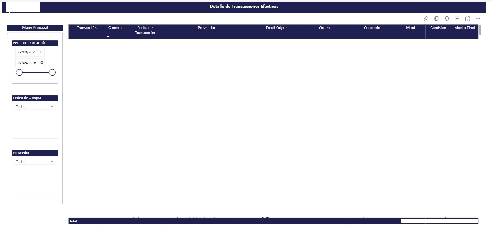

# 📊 Case Study: POWER BI Embedded - Capacity SKU A3 (Azure)

## 🚨 Problemática 
La solución operativa basada en licencias Power BI Pro presentaba restricciones críticas para el crecimiento del negocio:
* **Restricción de Escalabilidad:** No permitía el uso masivo de reportes embebidos para clientes externos.
* **Bloqueo de Tokens:** Limitación técnica en la generación de *Embed Tokens*.
* **Limitación de Performance:** El modelo monolítico original presentaba riesgos de saturación de memoria para la capacidad inicial contratada.

---

## 🎯 Objetivo
Activación y configuración del servicio de **Power BI Embedded** en Azure para lograr:
* **Consumo Transparente:** Visualización de reportes desde la App nativa sin requerir licencias Pro individuales para los clientes.
* **Seguridad de Datos:** Garantizar el aislamiento de información mediante **Row-Level Security (RLS)**.
* **Optimización de Costos:** Uso de capacidad dedicada (**SKU A3**) para una gestión eficiente de recursos.
* **Automatización:** Generación ilimitada de tokens de seguridad vía **API REST**.

---

## ✅ Solución Implementada
Se realizó la provisión de una capacidad dedicada en Microsoft Azure y una reingeniería profunda de la arquitectura de datos:

* **Segmentación de Modelos Semánticos:** Se dividió el modelo de datos original en **4 modelos independientes** especializados. 
* **Optimización de Memoria:** Cada modelo alimenta un reporte específico, permitiendo un uso eficiente de la RAM de la capacidad A3 y reduciendo los tiempos de carga en la web.
* **Autenticación Robusta:** Uso de **Service Principal** (App Only) para la comunicación segura entre el backend de la aplicación y Power BI Service.
* **Integración Frontend:** Inserción de reportes mediante el SDK de Power BI para **React y Javascript**.
* **Seguridad de Fila:** Se configura el parametro de Cliente Identificador en cada uno de los modelos semanticos de Power BI para que la API Rest realice las validaciones y filtre la información solo del cliente que inició sesion en la página web de la empresa.

## ✅ Arquitectura Implementada

---

## 🚀 Resultados
* **Habilitación en Producción:** Reportes operativos dentro de la APP, consumidos por usuarios finales de forma fluida.
* **Mejora en Performance:** Tiempos de respuesta optimizados gracias a la división de modelos y la gestión de capacidad dedicada.
* **Producto Data-Driven:** Base tecnológica sólida para ofrecer analítica avanzada como un valor agregado del producto financiero.
* **Seguridad Garantizada:** Aplicación estricta de RLS, asegurando que cada usuario acceda únicamente a sus propios registros.

Ejemplo de un reporte:

---

## 💡 Beneficios Obtenidos
* **UX Centralizada:** Visualización **100% integrada** sin fricciones de inicio de sesión externas.
* **Ahorro en Licenciamiento:** Reducción del **90% en costos de licencias mensuales** al evitar el pago de suscripciones Pro individuales para clientes externos.
* **Optimización de Performance:** Mejora del **45% en los tiempos de renderizado** de los reportes tras la segmentación en 4 modelos semánticos.
* **Escalabilidad Garantizada:** Capacidad para soportar hasta **100+ usuarios concurrentes** sin degradación de servicio bajo el SKU A3.
* **Seguridad Total:** Reducción de filtración de datos al **0%** cruzados entre clientes gracias a la robustez del RLS dinámico.

---

## 🛠️ Tecnologías Utilizadas
* **BI:** Microsoft Power BI (Desktop & Service)
* **Cloud:** Microsoft PowerBI Embedded (Azure SKU A3)
* **Identity:** Azure Microsoft Entra ID (Service Principal)
* **Integración:** API Rest Power BI & SDK Client
* **Web Stack:** Javascript & React
