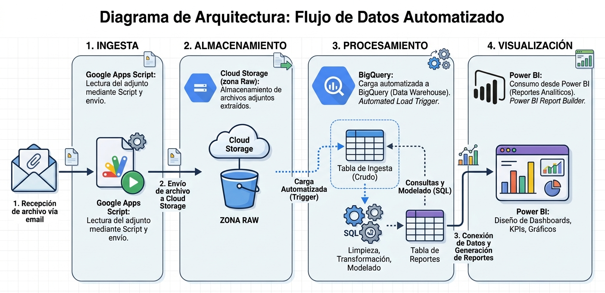
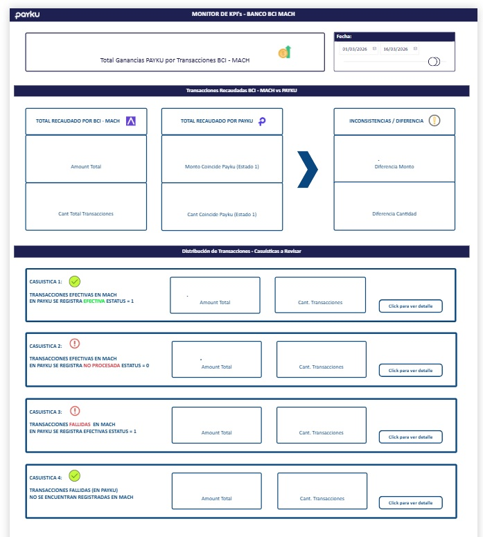

# 📊 Case Study: Automatización de Auditoría Interna & Conciliación (Fintech-Bank)

## 📝 Resumen del Proyecto
Implementación de un pipeline de datos **end-to-end** para la conciliación automatizada entre los registros de Payku y el banco BCI-MACH. La solución migró un proceso manual propenso a errores hacia una arquitectura **Serverless en Google Cloud Platform (GCP)**.

---

## 🚨 Problemática 
* **Procesamiento Manual:** Validación de transacciones dependiente de intervención humana, generando alta latencia y riesgos de integridad.
* **Falta de Trazabilidad:** Inexistencia de un histórico centralizado para auditorías retrospectivas o detección de desviaciones financieras en tiempo real.

---

## 🛠️ Solución Implementada: Arquitectura Serverless
Se diseñó un flujo de datos automatizado que garantiza la integridad mediante validaciones en cada etapa:

* **Ingesta Inteligente:** Extracción automatizada desde Gmail API hacia **Google Cloud Storage (Staging Area)** mediante Python y Apps Script.
* **Validación de Integridad:** Sistema de control de duplicados y validación de esquemas antes de la ingesta a **BigQuery**.
* **Data Warehouse:** Centralización en BigQuery para análisis histórico y ejecución de consultas de conciliación complejas.
* **Capa de Visualización:** Dashboard en Power BI conectado mediante DirectQuery/Import para monitoreo de discrepancias.

## ✅ Arquitectura Implementada

---

## 🚀 Pipeline de Datos: Gmail to BigQuery
El flujo se apoya en tres componentes de control críticos:
1. **Script 1 (Extraction):** Escaneo de hilos de Gmail y carga a GCS con verificación de existencia para evitar sobrescrituras. [Ver Script](../Scripts/FromGmailToStorage.py)
2. **Script 2 (Load Job):** Ingesta automática a BigQuery con detección dinámica de esquemas. [Ver Script](../Scripts/FromStorageToBigQuery.py)
3. **Notificaciones:** Sistema de alertas automáticas (éxito/error) vía email para monitorear el estado del pipeline.

---

## 📊 Estrategia de BI & Big Data (Capa de Visualización)
El producto final es un ecosistema analítico en Power BI diseñado para el procesamiento eficiente de grandes volúmenes de datos alojados en **Google Cloud Platform**:

* **Arquitectura de Alto Rendimiento:** Uso de conexión nativa y **vistas pre-procesadas** en BigQuery. Al delegar el procesamiento pesado al Data Warehouse, se garantiza fluidez extrema incluso con millones de registros.
* **Modelo Híbrido Inteligente:** Implementación de un esquema de almacenamiento que combina **Import y DirectQuery**, equilibrando la velocidad de respuesta con la capacidad de consultar el histórico total sin latencia.
* **Conciliación Automatizada (DAX):** Sustitución de la revisión manual por lógica de **Matching automático** en DAX, permitiendo el cruce instantáneo de transacciones entre la Fintech y el banco.
* **Gestión por Excepción:** Diseño de interfaz enfocado exclusivamente en **Deltas (discrepancias)**; el sistema resalta automáticamente los errores, permitiendo que el auditor actúe solo donde es necesario.

> ### 🚀 Valor Técnico del Enfoque
> * **Seniority en BigQuery:** Optimización desde el origen para evitar reportes lentos.
> * **Arquitectura Cloud:** Manejo experto de procesamiento híbrido para optimizar recursos.
> * **Eficiencia de Negocio:** Transformación de una tarea de horas en una gestión de minutos basada en hallazgos.

---

## 💡 Impacto y Beneficios Obtenidos
* **Eficiencia Operativa:** Reducción del **95% en el tiempo de procesamiento**, pasando de horas de trabajo manual a una ejecución automática de minutos.
* **Capacidad de Carga:** Procesamiento diario de **500,000+ registros** sin degradación de rendimiento.
* **Optimización de Costos:** Arquitectura *Pay-as-you-go* con un costo operativo inferior a **$10 USD mensuales**.
* **Confianza en la Auditoría:** Trazabilidad total (log de errores y duplicados), asegurando el **100% de integridad** en las conciliaciones diarias.

---

## 🛠️ Tecnologías Utilizadas
* **Cloud:** Google Cloud Platform (GCP), Cloud Storage, BigQuery.
* **Languages:** Python 3.8, Google Apps Script.
* **APIs:** Gmail API, OAuth 2.0 (Service Accounts).
* **BI:** Microsoft Power BI.
