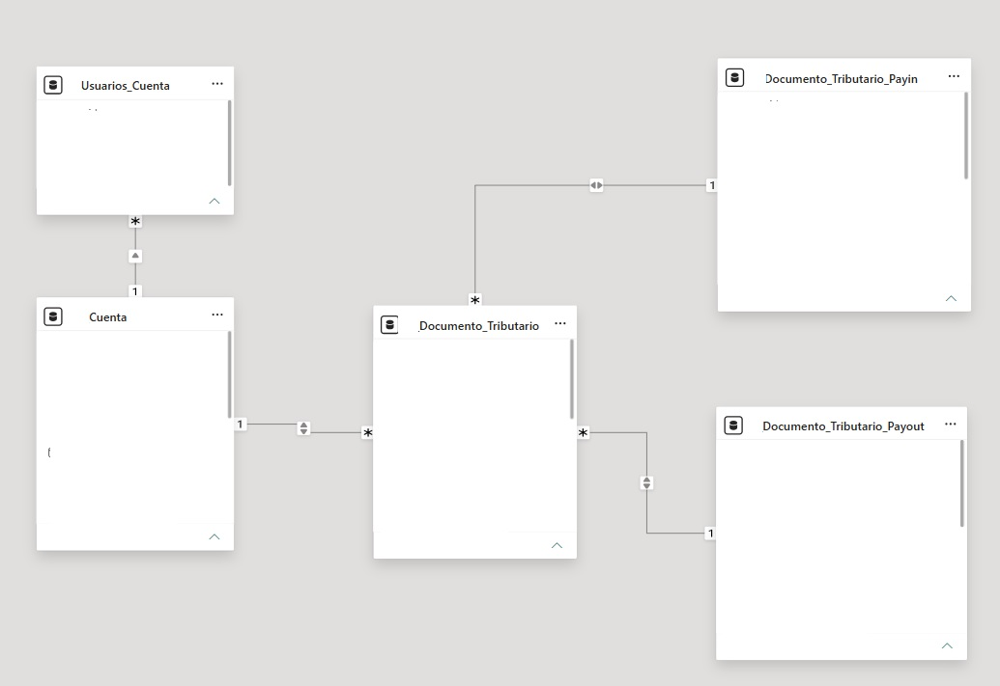
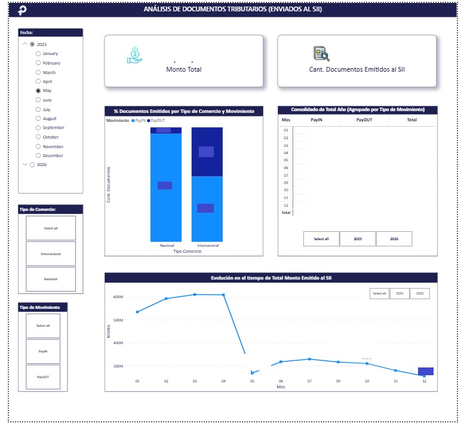
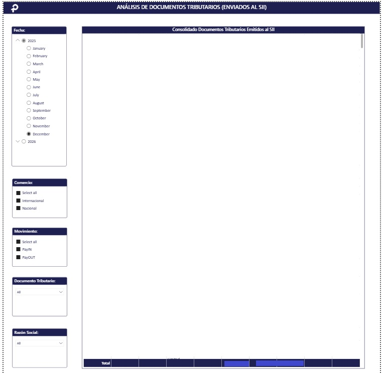

# 🧾 Análisis de Documentos Tributarios (Auditoría Electrónica al SII)

## 📝 Resumen del Proyecto
Desarrollo de un ecosistema analítico en Power BI para el control, cruce y auditoría de documentos tributarios electrónicos (facturas, boletas, notas de crédito) enviados al **Servicio de Impuestos Internos (SII)**. 

El proyecto transforma logs de datos semiestructurados y registros planos en un tablero dinámico que permite monitorear montos totales, volúmenes de emisión y comportamiento transaccional (Ingresos vs. Egresos) por tipo de comercio.

## 🎯 El Reto Técnico
El principal desafío de este proyecto radicaba en la compleja estructura de los datos en origen (provenientes de una única tabla transaccional), presentando las siguientes problemáticas:

1. **Datos en la misma fila (Columnas Cruzadas):** Los registros de ingresos y egresos venían acoplados horizontalmente en la misma fila (ej: `folio_ingreso`, `folio_egreso`, `monto_ingreso`, `monto_egreso`), impidiendo un análisis de series de tiempo nativo.
2. **Información Anidada (String Arrays):** El detalle financiero crítico (Monto, IVA, etc.) venía encapsulado dentro de respuestas de servicios en formato de texto plano/array de PHP (`request_ingreso`, `request_egreso`).
3. **Requerimiento de Exportación:** El equipo operativo requería tanto la vista macro de KPIs como un módulo de "grano fino" para descargar listados masivos a Excel sin degradar el rendimiento del modelo.

---

## 🏗️ Solución Arquitectónica e Ingeniería de Datos

Para resolver la complejidad del origen, se diseñó un pipeline de transformación de datos en **Power Query (M)** y **DAX** estructurado en las siguientes etapas:

### 1. Desacople y Normalización (Estrategia de Append)
En lugar de trabajar con la tabla plana original (que estresaba el modelo), se optó por una arquitectura de bifurcación y consolidación:
* **Segmentación:** Se crearon dos consultas independientes apuntando al mismo origen: una especializada exclusivamente en **Ingresos** y otra en **Egresos**, aislando sus columnas correspondientes.
* **Consolidación (Append):** Se ejecutó una operación de anexado (*Append*) para unificar ambas consultas en una **única tabla consolidada de hechos**, transformando el modelo horizontal en un modelo vertical óptimo para analítica.



### 2. Extracción de Datos Semi-Estructurados (Parsing en Power Query)
Para abrir los arrays de PHP y extraer los valores tributarios sin recurrir a procesos pesados de backend, se implementaron funciones avanzadas de manipulación de texto en Power Query para delimitar y tipificar los campos ocultos en la columna `response_webservice`:

```powerquery
// Extracción dinámica del folio tributario desde el string/array
Number.FromText(
    Text.BetweenDelimiters([response_webservice], "[folio] => ", "#(lf)")
)

Esta lógica se replicó para extraer campos clave como montos netos, IVA, tipos de documentos, etc.
```

---

## 📊 Diseño del Dashboard y Capa de Visualización

El reporte se estructuró estratégicamente en dos secciones clave para cubrir de forma eficiente las necesidades de los perfiles gerenciales y operativos:

### 1. Página 1: Panel de Control y Análisis Macroeconómico
* **KPIs Principales:** Tarjetas dinámicas con el acumulado del *Monto Total ($111.1M+)* y la cantidad neta de documentos emitidos con éxito al SII.
* **Distribución de Mercado:** Gráfico de barras 100% apiladas que permite contrastar el comportamiento de movimientos de *PayIn* y *PayOut*, segmentado por tipo de comercio (Nacional vs. Internacional).
* **Consolidado Mensual:** Matriz de control anualizada que desglosa mes a mes los flujos financieros de entrada y salida para cierres contables rápidos.
* **Tendencia Temporal:** Gráfico de líneas que expone la evolución del monto emitido en el tiempo, identificando picos transaccionales o caídas anómalas en la operación.



### 2. Página 2: Listado Maestro y Extracción de Datos
* **Diseño Operativo:** Configuración de una tabla densa de detalles que expone folios, fechas, comercios y montos específicos.
* **Optimización de Auditoría:** Diseñado especialmente para que el equipo de Contab ilidad aplique filtros cruzados y utilice la característica nativa de *Exportación de Datos a Excel*, agilizando los procesos de auditoría externa.



---

## 💡 Impacto y Beneficios Obtenidos

* **⚙️ Automatización del Proceso:** Se sustituyó por completo el parseo manual de *strings* y la separación horizontal de columnas que el equipo de operaciones realizaba en Excel, reduciendo el tiempo de preparación de datos de horas a cero.
* **⚡ Performance del Reporte:** Al transformar la estructura original de tabla ancha en un modelo consolidado vertical, se optimizó el peso del modelo semántico, permitiendo transiciones de filtros e interacciones instantáneas.
* **👤 Autonomía Operativa:** La inclusión de la segunda página (Listado Maestro) eliminó los cuellos de botella y las solicitudes de extracción de datos (*queries* a la base de datos) al equipo de TI, permitiendo que los usuarios de negocio se auto-atiendan.

---

## 🛠️ Tecnologías Utilizadas

* **BI Engine:** Power BI Desktop.
* **Data Preparation:** Power Query (Lenguaje M avanzado para *parsing* y delimitación de texto).
* **Lógica Semántica:** Expresiones DAX para la creación de medidas de cálculo, acumulados y tendencias temporales.
