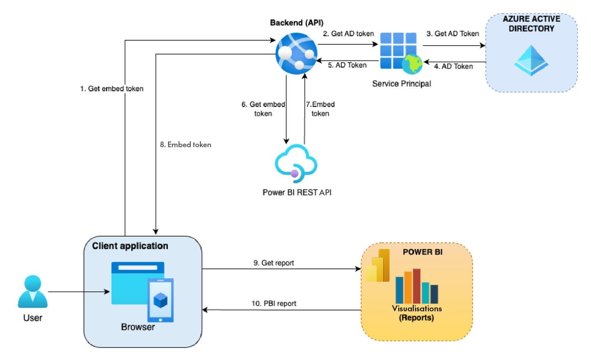
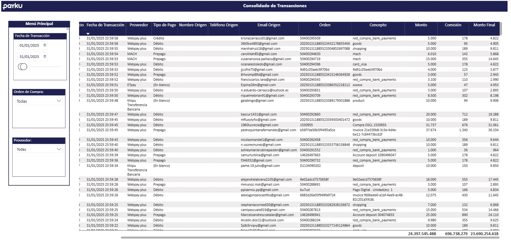

# 🌐 Arquitectura de Analítica Embebida: Integración con Power BI Embedded

## 📝 Resumen del Proyecto
Diseño e implementación de una arquitectura de analítica embebida de nivel empresarial para integrar tableros de control directamente en el portal web de la empresa (Frontend en **React**). La solución transforma reportes internos en un producto analítico orientado al cliente final (*Customer-Facing Analytics*), utilizando la **API REST de Power BI** para una carga fluida y garantizando un aislamiento estricto de los datos mediante un modelo multi-inquilino (*Multi-tenancy*).

---

## 🎯 Objetivo
Activación del servicio de PowerBI Embedded basada en la nube que permite:
* Consumo de los reportes desde la App Payku sin necesidad de licencias individuales de Power BI Pro.
* Garantizar seguridad de acceso a la información mediante RLS.
* Optimizar costos mediante capacidad dedicada (SKU A3).
* Generación de tokens de seguridad desde la Api Rest ilimitados.

---

## ✅ Solución Implementada
Adquirir una capacidad dedicada Power BI Embedded A3 a través de Microsoft Azure, lo que permitirá:
*	✔ Generación ilimitada de Embed Tokens
*	✔ Uso de Service Principal para autenticación
*	✔ Integración de reportes en aplicaciones web o sistemas internos
*	✔ Escalabilidad según demanda

---

## ✅ Arquitectura Implementada

---

## 🏗️ Arquitectura Técnica del Ecosistema

La solución se estructuró dividiendo las responsabilidades en capas claras dentro de Power BI Service y el backend de la aplicación:

### 1. Capa de Contenedores: Workspace Dedicado
* **Creación de Workspace** 
* **Tipo de Capacidad:** Alojado en una capacidad dedicada de Azure (**Power BI Embedded Capacidad A3-Sku**) para permitir el consumo ilimitado de usuarios anonimizados mediante el esquema *App Owns Data* (La aplicación posee los datos).
* **Aislamiento:** Este espacio de trabajo está aislado de la reportería interna de la empresa, conteniendo exclusivamente los artefactos que serán expuestos al exterior.

### 2. Capa de Datos: Modelo Semántico Dinámico (Dataset)
* **Modelos Semánticos:** Se vincularon de forma nativa los **4 modelos semánticos independientes** (segmentados por Negocio-Pais), garantizando que la lógica de cálculo ya estuviera optimizada antes de la fase de integración web.

* **Modo de Almacenamiento:** Configurado en **Import Mode** con actualizaciones programadas diarias cada 3 horas, para optimizar costos de procesamiento.
* **Centralización:** Un único modelo semántico atiende a todos los clientes de la plataforma. Se consolidaron las tablas de hechos y dimensiones bajo un **Esquema en Estrella** altamente indexado.
* **Parámetro Clave (`Cliente_ID`):** Se definió un parámetro global de tipo texto dentro del modelo, el cual actúa como el puente de comunicación con la API de la aplicación para filtrar el contexto del usuario logueado.

> 💡 **Nota de Diseño:** Al reutilizar los 4 modelos existentes en lugar de duplicar la data, se logró mantener una **única fuente de verdad** y se redujo a cero el esfuerzo de mantenimiento del backend de datos durante el despliegue del entorno embebido.
> 

---

### 3. Capa de Visualización: Reportes Core
* **Diseño UX/UI:** Desarrollado con páginas de estilo personalizadas para homologar los colores, tipografías y componentes visuales con la paleta de la aplicación web, logrando que el reporte se perciba como una sección nativa del software.
* **Navegación:** Se deshabilitaron las barras de navegación nativas de Power BI, delegando los filtros y el cambio de pestañas a botones personalizados embebidos en el frontend.

---

## 🔐 Arquitectura de Seguridad y Flujo de Autenticación (RLS Dinámico)

Para garantizar la confidencialidad de la información en un entorno multi-inquilino, el flujo de acceso sigue una arquitectura síncrona basada en **Row-Level Security (RLS)** controlado por el backend.

Dentro del modelo semántico se configuró un rol de seguridad activa por medio de un parámetro llamado `RLS`. Este aplica un filtro dinámico sobre la tabla de Clientes mediante la siguiente expresión DAX:

[Clientes.cliente_id] = CONTAINSSTRING(CUSTOMDATA(),Clientes[cliente_id])

> ℹ️ Nota técnica: Al utilizar el esquema de Power BI Embedded, el valor devuelto por la función USERNAME() no corresponde a un correo electrónico de Azure AD, sino al string alfanumérico estricto del cucu_identificador que la API REST del backend inyecta dinámicamente al momento de generar el Embed Token.
>

---

## 🚀 Resultados
*	Habilitación de reportes en la APP Payku Usuarios
*	Mejora en la entrega de información a clientes
*	Base tecnológica para productos data-driven
* La solución permite a usuarios de negocio visualizar su información, cumpliendo con estándares de seguridad mediante Row-Level Security (RLS).
Actualmente, los reportes se encuentran en producción, operativa y consumida a través de APIs REST.

---

## 💡 Impacto y Beneficios Obtenidos
* **UX Centralizada:** Visualización **100% integrada** sin fricciones de inicio de sesión externas.
* **Ahorro en Licenciamiento:** Reducción del **90% en costos de licencias mensuales** al evitar el pago de suscripciones Pro individuales para clientes externos.
* **Optimización de Performance:** Mejora del **45% en los tiempos de renderizado** de los reportes tras la segmentación en 4 modelos semánticos.
* **Escalabilidad Garantizada:** Capacidad para soportar hasta **100+ usuarios concurrentes** sin degradación de servicio bajo el SKU A3.
* **Seguridad RLS:** Reducción de filtración de datos al **0%** cruzados entre clientes gracias a la robustez del RLS dinámico.
* **Seguridad Certificada:** Mitigación total del riesgo de filtración de información (Data Leakage) entre cuentas. Al ejecutarse la seguridad directamente en el motor de Power BI (Backend), las reglas de acceso son inviolables y no pueden ser manipuladas desde las herramientas de desarrollador en el navegador del cliente (Frontend).

---

## 🛠️ Stack Tecnológico Utilizado

* ✔ **BI Core:** Power BI Desktop / Power BI Service (Embedded Capacity A3-Sku).
* ✔ **Backend Integration:** API REST de Power BI, Azure Active Directory (Service Principal / OAuth 2.0).
* ✔ **Frontend Component:** Power BI Client React Library (powerbi-client-react).
* ✔ **Base de Datos:** MySQL (On-Premises)
* ✔ **Conectividad:** Data Gateway en Servidor Dedicado
* ✔ **Modelado:** Esquema en Estrella (Star Schema)
* ✔ **Automatización:** Actualización Incremental (Schedule diario)

